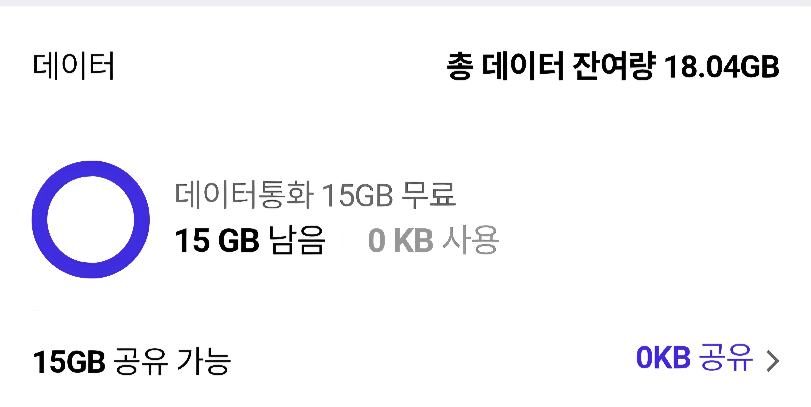
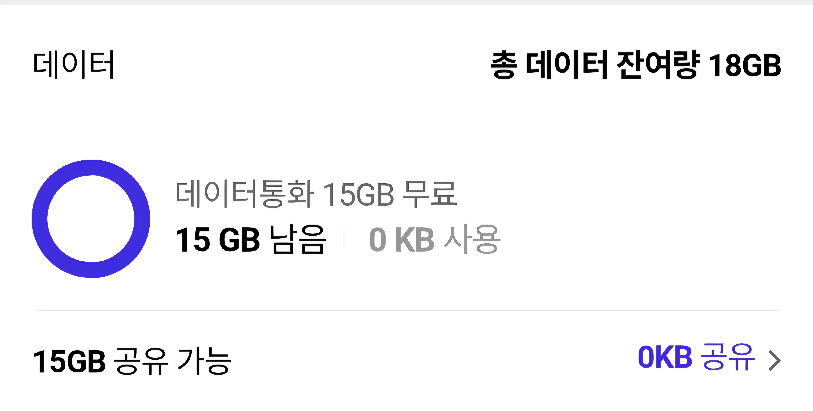
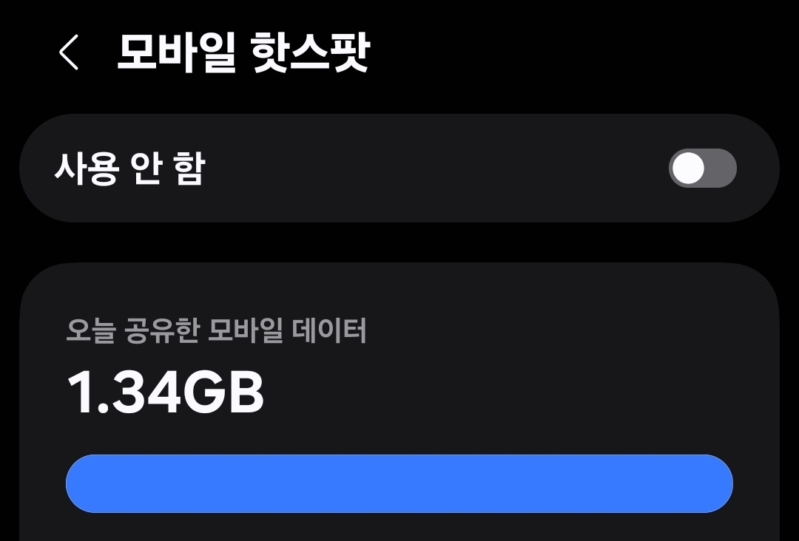

# TCP Retransmission VPN

TCP 재전송 메커니즘을 활용한 트래픽 위장 기반의 터널링 VPN 구현체입니다.

## 개요

본 프로젝트는 VPN 터널의 모든 데이터 패킷을 TCP 재전송 세그먼트로 위장하여 전송하는 방식을 시용하고 있습니다. 클라이언트-서버 간 통신에서 동일한 TCP sequence number를 반복적으로 사용함으로써, 네트워크 관측 시점에서 해당 트래픽이 단일 TCP 세그먼트에 대한 재전송으로 식별됩니다.

한국 통신사 시스템은 재전송 패킷에 대해 별도의 심층 분석을 수행하지 않으며, 이러한 특성을 이용하여 트래픽에 대한 과금을 우회할 수 있습니다.

## 아키텍처

```
Windows Client                            Linux Server
┌────────────────┐                        ┌────────────────┐
│  Application   │                        │   Internet     │
│       ↕        │                        │       ↕        │
│  TUN (WinTun)  │   TCP (seq=N 고정)     │  TUN (tun0)    │
│  10.8.0.2/24   │◄──────────────────────►│  10.8.0.1/24   │
│       ↕        │   fake retransmission  │       ↕        │
│  Npcap (NDIS)  │──────────────────────►│  raw socket    │
└────────────────┘                        └────────────────┘
```

Windows 클라이언트 :  Npcap을 통해 NDIS 레벨에서 raw TCP 패킷을 송수신하며, WinTun 가상 네트워크 어댑터를 통해 시스템 트래픽을 캡처합니다.
Linux 서버 : raw socket 기반으로 동작하며, TUN 인터페이스와 NAT를 통해 클라이언트의 트래픽을 인터넷으로 포워딩합니다.

## 프로토콜 상세

### 연결 수립

```
Client                          Server
  │                               │
  │──── SYN ─────────────────────►│
  │◄─── SYN-ACK (syncookie) ─────│
  │──── ACK (cookie 검증) ───────►│  ← 세션 생성
  │                               │
  │──── [공개키 + PSH/ACK] ──────►│
  │◄─── [서버 공개키] ────────────│  ← ECDH 키 교환
  │                               │
  │──── [암호화된 검증 토큰] ────►│
  │◄─── [암호화된 검증 응답] ────│  ← 상호 검증 완료
  │                               │
  │◄══► 암호화된 데이터 전송 ◄══►│  ← seq 고정, 재전송 위장
```

1. TCP 핸드셰이크: 서버는 SYN cookie 기반의 stateless 핸드셰이크를 수행하여 SYN flood 공격에 대한 내성을 확보합니다.
2. 키 교환: ECDH(Curve25519)를 통해 공유 비밀을 생성하고, 사전 공유 키(PSK)와 SHA-256으로 혼합하여 최종 세션 키를 도출합니다.
3. 상호 검증: 양측이 동일한 검증 토큰을 암호화·복호화함으로써 키 교환의 무결성을 확인합니다.
4. 데이터 전송: 연결 수립 이후 모든 페이로드는 고정된 sequence number로 전송되어 TCP 재전송으로 위장됩니다.

### 암호화

| 항목        | 사양                                         |
| ----------- | -------------------------------------------- |
| 키 교환     | ECDH Curve25519 + PSK (SHA-256 혼합)         |
| 대칭 암호   | ChaCha20-Poly1305 (AEAD)                     |
| 키 분리     | 방향별 독립 키 도출 (`c2s` / `s2c`)      |
| Replay 방지 | nonce 기반 sliding window (64 패킷)          |
| 패킷 구조   | `[8B nonce][ciphertext][16B Poly1305 tag]` |

## 요구 사항

### 서버 (Linux)

- Go 1.24 이상
- root 권한
- iptables

### 클라이언트 (Windows)

- Go 1.24 이상
- [Npcap](https://npcap.com) (패킷 캡처 드라이버)
- [wintun.dll](https://wintun.net) (실행파일과 동일한 디렉터리에 배치)
- 관리자 권한

## 빌드

```bash
go mod tidy

# Windows 클라이언트 (CLI)
go build -o bin/client.exe ./cmd/client

# Windows 클라이언트 (GUI)
go build -ldflags "-H windowsgui" -o bin/client-gui.exe ./cmd/client-gui

# Linux 서버
go build -o bin/server ./cmd/server
```

## 실행

### 서버

```bash
sudo ./bin/server -key <PSK> [-port 9999]
```

서버 구동 시 TUN 인터페이스 생성, IP 포워딩 활성화, NAT(masquerade) 설정, RST 차단 규칙이 자동으로 적용됩니다. 종료 시 해당 설정은 자동으로 정리됩니다.

### 클라이언트 (CLI)

```bash
.\bin\client.exe -server <SERVER_IP> -key <PSK> [-port 9999]
```

### 클라이언트 (GUI)

```bash
.\bin\client-gui.exe
```

서버 주소와 인증 키를 입력한 후 연결 버튼을 통해 VPN에 접속합니다. 시스템 트레이 아이콘을 통한 백그라운드 실행을 지원합니다.

## 프로젝트 구조

```
cmd/
  client/              CLI 클라이언트 진입점 (Windows)
  client-gui/          GUI 클라이언트 진입점 (Windows, lxn/walk)
  server/              서버 진입점 (Linux)

internal/
  client/              VPN 클라이언트 로직 (연결, TUN 관리, 트래픽 포워딩)
  config/              프로토콜 상수 (포트, MTU, 타임아웃, 주소 체계)
  crypto/              ECDH 키 교환, ChaCha20-Poly1305 암호화/복호화
  netutil/             관리자 권한 확인, 기본 게이트웨이 조회
  packet/              TCP/IP 패킷 빌드, 파싱, 체크섬 계산, IP 리라이트
  server/              서버 세션 관리, SYN cookie, 트래픽 포워딩
  transport/           raw socket/pcap 전송 계층, 세션 상태, IP 풀
  tun/                 TUN 디바이스 추상화 (WinTun / Linux TUN)
```

## 테스트 결과

모바일 핫스팟을 통해 1.34GB의 데이터를 전송한 후, 통신사 데이터 잔여량 변화를 확인한 결과입니다.

|                   테스트 전 데이터 잔여량                   |                   테스트 후 데이터 잔여량                   |                   핫스팟 데이터 공유량                   |
| :----------------------------------------------------------: | :---------------------------------------------------------: | :-------------------------------------------------------: |
|  |  |  |
|                           18.04GB                           |                            18GB                            |                          1.34GB                          |

핫스팟으로 1.34GB를 전송했으나 데이터 잔여량은 약 0.04GB만 차감되었습니다.

## 안내 사항

본 소프트웨어는 네트워크 프로토콜 연구 및 보안 기술 학습을 목적으로 개발되었습니다. TCP 재전송 메커니즘의 동작 방식과 raw socket 기반 패킷 처리, 암호화 통신 구현 등 네트워크 엔지니어링 전반에 대한 기술적 탐구를 위한 것입니다.

본 소프트웨어의 사용으로 인해 발생하는 모든 결과에 대한 책임은 전적으로 사용자에게 있으며, 개발자는 이에 대해 어떠한 법적 책임도 부담하지 않습니다. 사용자는 본 소프트웨어를 사용하기 전에 해당 국가 및 지역의 관련 법령과 통신사 이용약관을 반드시 확인하시기 바랍니다.
